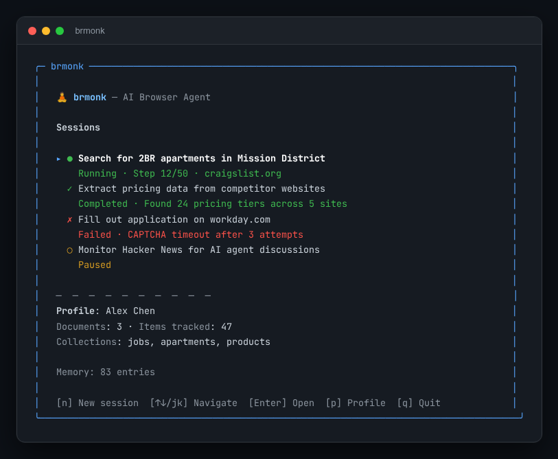
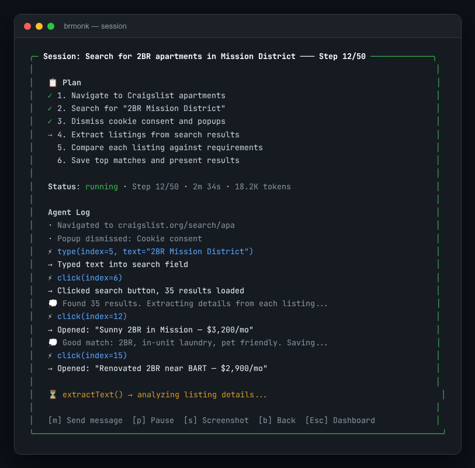
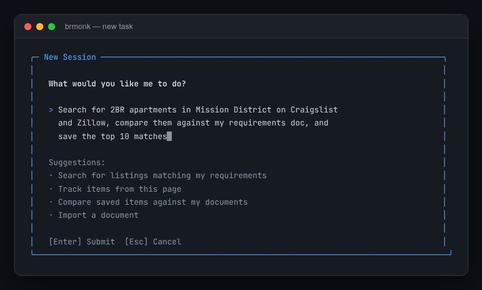
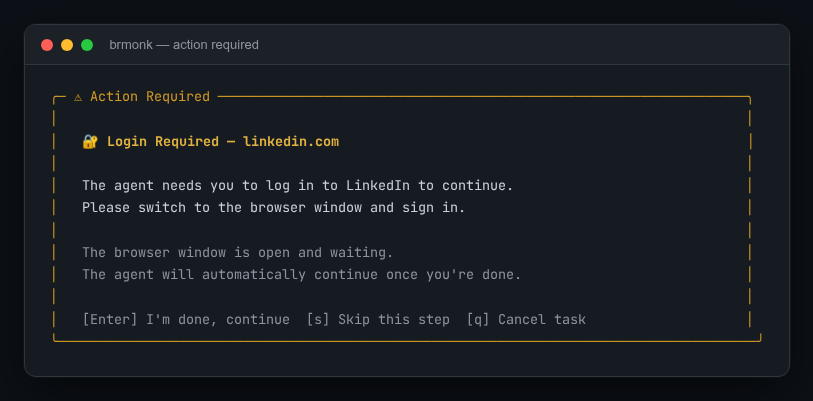
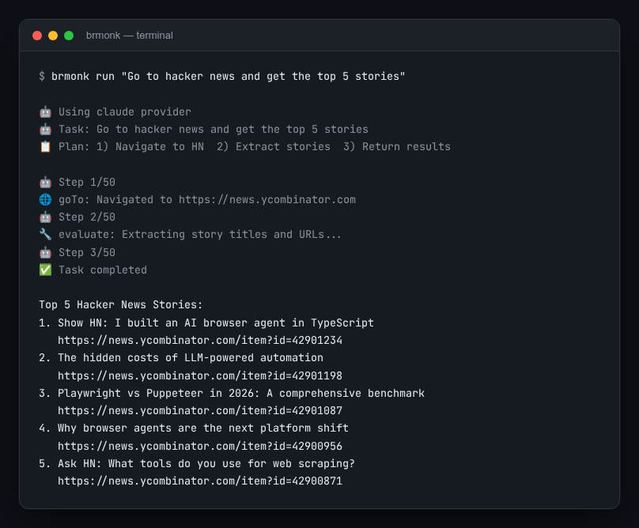

# brmonk

AI-powered browser automation agent with a built-in TUI dashboard. Uses Playwright for browser control with support for multiple LLM providers (Claude, OpenAI, Grok/xAI).

## Screenshots

### Dashboard
Multi-session overview with status indicators, profile summary, and keyboard navigation.



### Session View
Live agent execution with plan tracking, step-by-step log, token usage, and elapsed time.



### New Task Input
Task input with word wrapping, cursor, and smart suggestions.



### Action Required
The agent pauses and prompts you when it needs human intervention (login, CAPTCHA, etc.).



### CLI Mode
Run tasks directly from the command line without the TUI.



## Features

- **Multi-LLM Support** — Claude (Anthropic), GPT-4o (OpenAI), and Grok (xAI). Auto-detects available API keys.
- **TUI Dashboard** — Real-time terminal UI showing agent progress, plans, logs, and session history.
- **Persistent Browser Context** — Cookies and localStorage survive across sessions. Log in once, stay logged in.
- **Smart Agent Loop** — Observe-reason-act cycle with automatic CAPTCHA/login detection, popup dismissal, and retry logic.
- **Document Management** — Import and manage documents (resumes, requirements, wish lists) for AI-powered matching.
- **Item Tracking** — Track anything found while browsing (jobs, apartments, products, contracts) and match against your documents.
- **Extensible Skills** — Plugin system for custom automation skills (tracker, documents, smart-browse built in).
- **Session Memory** — All sessions are saved and reviewable. Rolling context summarization prevents token overflow.

## Architecture

```
┌─────────────┐     ┌──────────────┐     ┌───────────────┐
│   CLI/TUI   │────>│  Agent Loop  │────>│  LLM Provider │
│  (app.ts)   │<────│  (loop.ts)   │<────│  (claude/oai) │
└──────┬──────┘     └──────┬───────┘     └───────────────┘
       │                   │
       │  Events           │  Tools
       │                   v
       │            ┌──────────────┐
       │            │   Browser    │
       └───────────>│   Engine     │
                    │ (Playwright) │
                    └──────┬───────┘
                           │
                    ┌──────v───────┐
                    │  DOM Extract │
                    │  + Actions   │
                    └──────────────┘
```

The agent loop follows an **observe → reason → act** cycle:
1. **Observe** — Extract DOM snapshot (interactive elements, forms, headings, text summary)
2. **Reason** — Send observation to LLM, get tool calls back
3. **Act** — Execute browser actions (click, type, navigate, etc.)
4. **Repeat** until done or max steps reached

## Quick Start

```bash
# Install dependencies
npm install
npx playwright install chromium

# Set at least one API key
export ANTHROPIC_API_KEY=sk-ant-...
# or
export OPENAI_API_KEY=sk-...
# or
export XAI_API_KEY=xai-...

# Build
npm run build

# Launch TUI dashboard
brmonk

# Or run a single task
brmonk run "Search Google for Node.js jobs in San Francisco"

# Interactive REPL mode
brmonk interactive
```

## CLI Commands

```
brmonk                         Launch TUI dashboard
brmonk run <task>              Run a single automation task
  -p, --provider <provider>    LLM provider (claude, openai, grok, auto)
  -m, --model <model>          Model name
  --headful / --headless       Browser visibility
  --max-steps <n>              Maximum agent steps
  -v, --verbose                Verbose output

brmonk interactive             Start REPL mode
brmonk skills list             List available skills
brmonk history list            List past sessions
brmonk history show <id>       Show session details
brmonk profile show            Show your profile
brmonk profile set             Set profile interactively
brmonk profile import <file>   Import a document (shortcut for docs import --type resume)
brmonk items list              List tracked items
brmonk items collections       List collections and counts
brmonk docs list               List stored documents
brmonk docs show <id>          Show document content
brmonk docs import <file>      Import a document
brmonk docs delete <id>        Delete a document
brmonk config set <key> <val>  Set a config value
brmonk config show             Show current config
```

## TUI Dashboard

The TUI provides a real-time view of agent activity:

- **Dashboard** — Session list with status indicators (running/completed/failed/paused), profile summary, memory stats. Keys: `n` new task, `j/k` or arrows to navigate, `Enter` view session, `p` profile, `q` quit.
- **Session View** — Live agent log with plan progress, elapsed time, token usage, and current action. Keys: `m` or `Enter` to send message to agent, `p` pause/resume, `s` screenshot, `b` back.
- **Input View** — Task input with word wrapping, cursor blinking, and contextual suggestions.
- **Action Required** — Automatic detection of login walls and CAPTCHAs. The agent pauses, opens the browser, and waits for you to complete the action.

## Configuration

Config file: `~/.brmonk/config.json`

| Key | Default | Description |
|-----|---------|-------------|
| `provider` | `"auto"` | LLM provider |
| `model` | `""` | Model override |
| `headless` | `false` | Run browser headless |
| `maxSteps` | `50` | Max agent steps per task |
| `persistBrowserContext` | `true` | Keep cookies/localStorage across sessions |
| `verbose` | `false` | Verbose logging |

## Skills

Built-in skills extend the agent's capabilities:

- **tracker** — Track, organize, and match items found while browsing
- **documents** — Import, parse, and manage user documents for matching context
- **smart-browse** — Enhanced browsing with content extraction and summarization

Custom skills can be added to `~/.brmonk/skills/`.

## Development

```bash
npm run dev          # Watch mode
npm run build        # Compile TypeScript
npm run lint         # Type-check without emitting
npm run clean        # Remove dist/
```

## License

MIT
